# ⚡ Ultimate Data-Driven Market Intelligence Platform


A professional-grade financial analysis terminal that attempts to "Solve the Market" using a fusion of **Deep Learning (LSTM/XGBoost)**, **Hyper-Intelligence (Causal Chains)**, and **Multi-Agent Systems**.

---

## 🏗️ System Architecture

This system uses a **Multi-Agent Orchestrator** to fuse signals from 6 distinct intelligence engines.

```mermaid
graph TD
    User([User]) --> CLI{Ultimate CLI}
    CLI --> Orchestrator[Analysis Orchestrator]
    
    subgraph "Data Fusion Layer"
        Orchestrator --> Tech[Technical Engine]
        Orchestrator --> Quant[Quant Engine]
        Orchestrator --> ML[Machine Learning]
        Orchestrator --> Sentinel[Sentiment Aggregator]
    end
    
    subgraph "Hyper-Intelligence Layer"
        Orchestrator --> Macro[🌍 Macro Engine]
        Orchestrator --> Forensics[🔍 Forensic Validator]
        Orchestrator --> Graph[🕸️ Knowledge Graph]
    end
    
    subgraph "Self-Learning Layer"
        RL[Feedback Loop] --> Orchestrator
        ML --> RL
        RL --> Weights[(Policy Weights)]
    end
    
    Quant --> Signal{Decision Engine}
    Tech --> Signal
    ML --> Signal
    Macro --> Signal
    
    Signal --> CLI
```



---

---

## 🚀 Getting Started

### Prerequisites
- Python 3.10 or higher
- Node.js (for frontend/dashboard)
- Redis (optional, for caching)

### Installation & Launch
The easiest way to start is using the **Ultimate Launcher**:

**Linux / Mac:**
```bash
./ultimate.sh
```

**Windows:**
```cmd
ultimate.bat
```

---

## 🛠️ Script Toolbox

The project includes several scripts to manage the full lifecycle of the platform:

| Script | Description |
| :--- | :--- |
| `run-full-system.sh` | **Recommended.** Starts all services (API, Aggregator, Worker) in the background. |
| `start-all.sh` | Orchestrates the startup of all core backend components. |
| `stop-all.sh` | Cleanly terminates all running services. |
| `monitor.sh` | Real-time health and performance monitoring of active services. |
| `test-all.sh` | Runs the full suite of integration and unit tests. |
| `setup.sh` | Initial environment setup and dependency installation. |

### Running the Full System
To see the full script in action and run all services:
```bash
# Set permissions if needed
chmod +x *.sh

# Run the full system
./run-full-system.sh
```

---

## 📂 Documentation

Detailed documentation for various components can now be found in the [docs/](docs/) directory:

- [API Specification](docs/API_SPEC.md)
- [Database Schema](docs/DATABASE_SCHEMA.md)
- [ML Models Overview](docs/ML_MODELS.md)
- [Integration Guide](docs/INTEGRATION_GUIDE.md)
- [Deployment Instructions](docs/DEPLOYMENT.md)
- [And many more...](docs/)


## 📂 Project Structure

- `ultimate_cli.py`: The interactive terminal UI (Rich).
- `ultimate.sh` / `ultimate.bat`: Cross-platform launchers.
- `worker/src/`:
  - `orchestrator_enhanced.py`: Main logic hub.
  - `ml/`: LSTM and XGBoost models.
  - `engines/`: Decision, Macro, and Technical engines.
  - `knowledge_graph/`: NetworkX dependency graphs.

---

## 🛠️ Advanced Usage

**Direct Launch (Skip Menu):**
```bash
# Linux
./venv/bin/python ultimate_cli.py TATASTEEL.NS

# Windows
venv\Scripts\python ultimate_cli.py TATASTEEL.NS
```

---

**Confidence Score** is a dynamic metric derived from the **Reinforcement Learning (RL)** feedback loop. It adjusts based on 20+ factors including historical accuracy for the specific ticker.
# Market-Analysis
